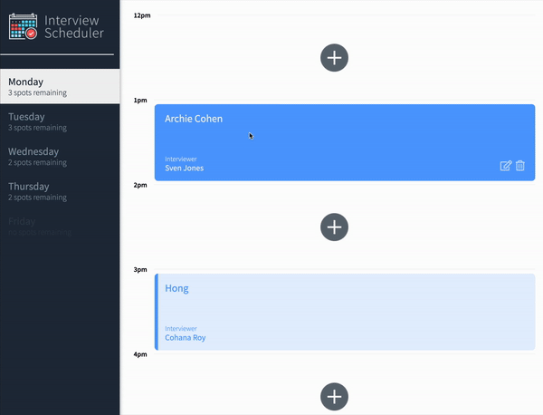
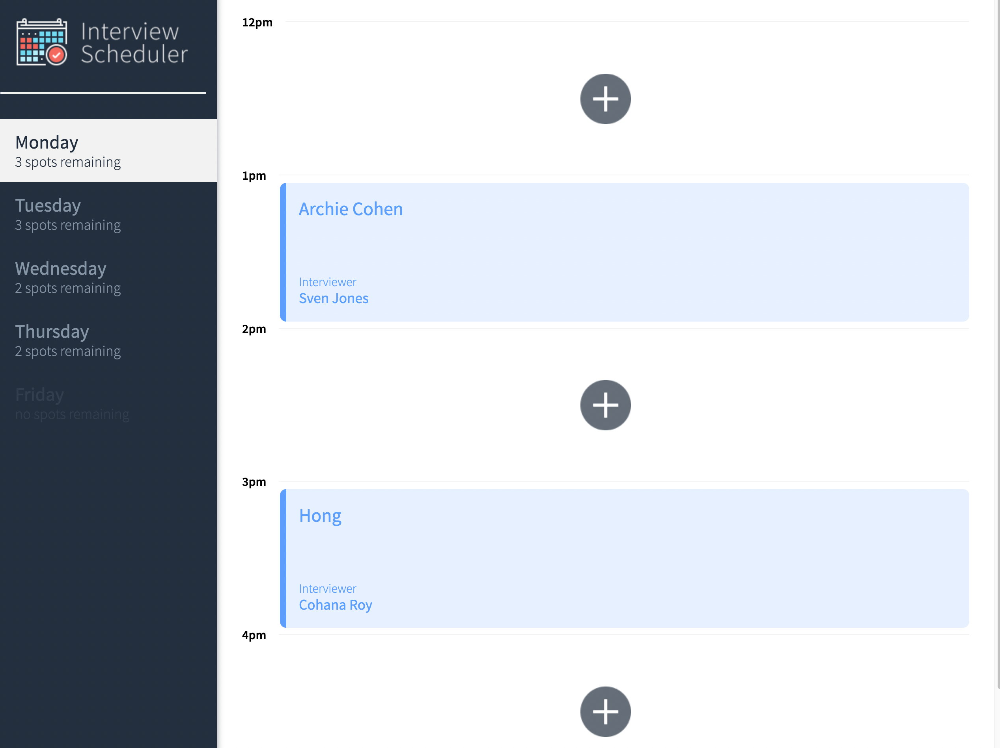
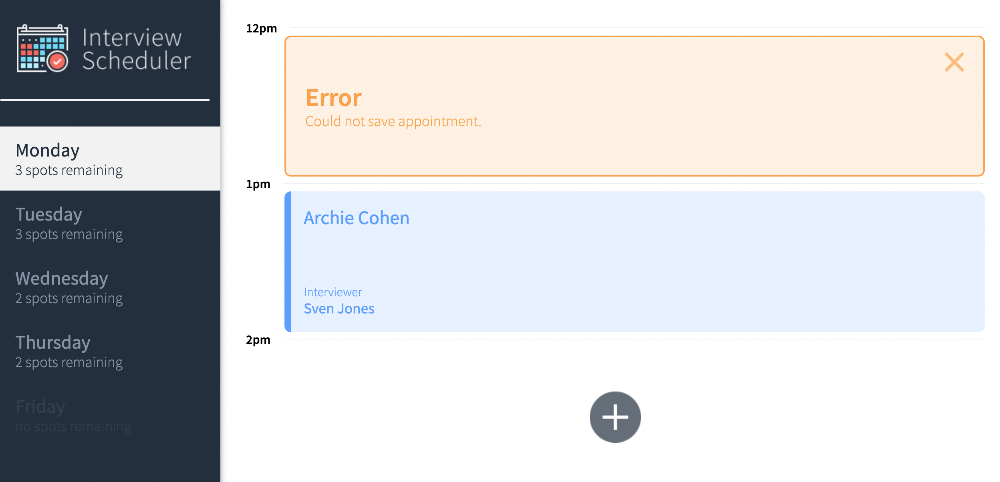

# Interview Scheduler
---

## Project Description
---
The interview Scheduler is an practice tool for streamlining the process of scheduling and conducting interviews. It allows users to create and manage interview schedules using the latest tools and techniques. We build and test this React application that allows users to book and cancel interviews. It also displays the spots remaining for interviews. We combine a concise API with a WebSocket server to build a realtime experience.

Link for scheduler api repo: [scheduler-api](https://github.com/Benjamin0203/scheduler-api)

## Project Features
---

- A user can switch between weekdays, book an interview in an empty appointment slot.
- A user can cancel or Edit an existing interview.
- Interviews are booked by typing in a student name and clicking on an interviewer from a list of available interviewers.
- The list of days informs the user how many slots are available for each day.
- The expected day updates the number of spots available when an interview is booked or canceled.
- A user is presented with a confirmation when they attempt to cancel an interview.
- A user is shown an error if an interview cannot be saved or deleted.
- A user is shown a status indicator while asynchronous operations are in  progress.
- When the user presses the close button of the error they are returned to the Form or Show view (skipping Status and Confirm).
- The application makes API requests to load and persist data. We do not lose data after a browser refresh.

---
### Showcase
---


### Main Page
---


### Error
---


## Setup
---
Install dependencies with `npm install`.

## Running Webpack Development Server
---
```sh
npm start
```

## Running Jest Test Framework
---
```sh
npm test
```

## Running Storybook Visual Testbed
---
```sh
npm run storybook
```
## Dependencies
---

- React
- Webpack, Babel
- Axios, WebSockets
- Axios
- Storybook, Webpack Dev Server, Jest, Testing Library
- Sass
- Cypress


